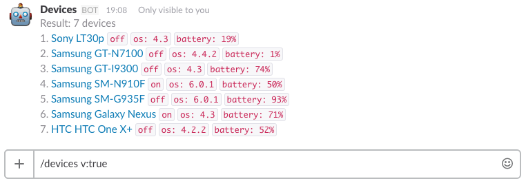
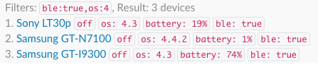

# Mobile Manager

[](https://travis-ci.org/elevenetc/mobile-manager)
[](https://codeclimate.com/github/elevenetc/device-manager-back-end)
[](https://codeclimate.com/github/elevenetc/device-manager-back-end/coverage)
[](https://codeclimate.com/github/elevenetc/device-manager-back-end)

Node service for tracking devices in Slack.

<p align="center"></p>

## Features

- track location of devices
- track online/offline state of a device
- track battery state
- see info about device: `os version`, `fingerprint`, `bluetooth`, `nfc`, `screen info`, `current wifi network`, `cpu info`
- filter devices

## Filtering examples

- filter by battery level: `/devices battery:>50` or `/devices battery:10` or `/devices battery:<90`
- filter by os: `/devices os:6.*.*` or `/devices os:6` or `/devices os:*.*.2`
- filter devices which support ble: `/devices ble:true`
- filter by cpu architecture: `/devices cpuArch:aarch64`
- filter by num of cores: `/devices cpuCoreNum:2` or `/devices cpuCoreNum:>2`
- mix any filters: `/devices ble:true,os:4`

<p align="center"></p>

- see verbose info: `/devices v:true`

<p align="center"></p>

## Setup
1. [Add and configure Slack command](https://api.slack.com/slash-commands)
2. [Configure Google Cloud Messages / Firebase Messages](https://support.google.com/firebase/answer/7015592)
1. Setup `MySQL` and create database
2. Install npm module: `npm install mobile-manager`
3. Create `app.js`
```javascript
const MobileManager = require('mobile-manager');
new MobileManager({
    dbFile: 'database name',
    dbUser: 'database user name',
    dbPass: 'database password',
    port: 6666,
    pingTimeout: 1000 * 60,
    keys:{
        googleCloud: 'google cloud key',
        slack: 'slack key'
    },
    logLevel: 'trace'
}).start();
```
And add `database name`, `database user name`, `database password`, `port`, `google cloud key` and `slack slash command key`.
`pingTimeout` is time in milliseconds which defines how often server sends push messages to devices.
## Run
`node app.js`
## Add devices
[Build, install and bind client](https://github.com/elevenetc/mobile-manager-android-client)
## Licence
[MIT](https://opensource.org/licenses/MIT)
